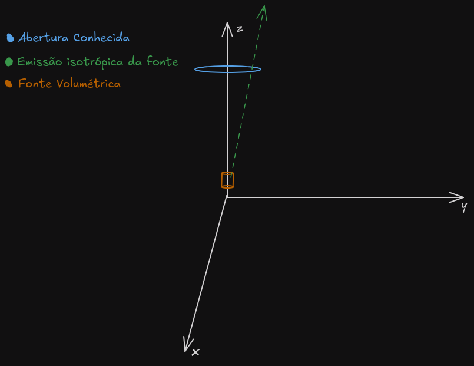

# fonte_volumetrica

Este projeto é uma continuação do projeto `Simulacao-MonteCarlo`, que se trata de uma validação do método onde se tinha um referencial teórico que foi atingido através do método de Monte-Carlo. Caso queira obter mais informações do projeto, você pode acessar o repositório através [deste link](https://github.com/AlexandreNevesdeFreitas/Simulacao-MonteCarlo).

## Sobre o projeto

Este projeto é uma simulação de fontes isotrópicas em um contexto geométrico. A simulação modela uma fonte que emite partículas de maneira isotrópica (em todas as direções) e uma abertura localizada acima dessa fonte. A altura da fonte pode variar, bem como o tipo desta fonte (pontual ou volumétrica) e o objetivo da simulação é verificar se as partículas emitidas passam através da abertura.

Para ilustrar o contexto da simulação, veja o esboço do plano cartesiano abaixo:

O algoritmo realiza simulações e armazena os valores em um arquivo. Esses dados são posteriormente utilizados para plotar gráficos com o gnuplot.

### Tecnologias e Ferramentas Utilizadas

| Python | Gnuplot | 
|-----|-----|
|  | 

## Aplicações Práticas

A simulação realizada neste projeto é particularmente útil no contexto de câmaras de ionização do tipo poço. Essas câmaras são utilizadas para medir a intensidade de radiação, e a precisão na detecção e análise das partículas é crucial para a eficácia dos dispositivos. A validação do método isotrópico e a análise da vazão de partículas através de aberturas fornecem dados valiosos para melhorar a compreensão e o desempenho dessas câmaras.

## Objetivos

- Verificação da Abertura: Avaliar se as direções das partículas emitidas atingem a altura da abertura. Caso atinjam, determinar se, na altura da abertura, a direção da partícula está dentro do raio da abertura, indicando a vazão através da mesma.

