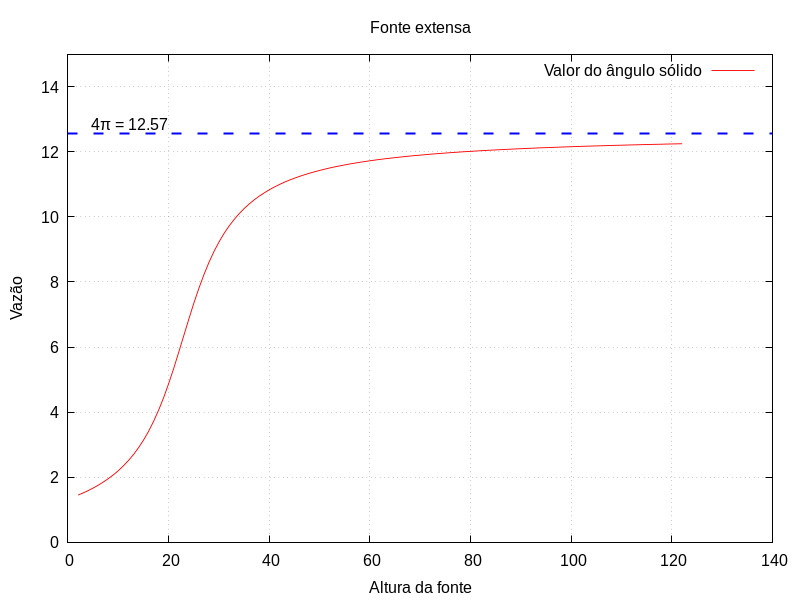

# Estimativa de ângulos sólidos através da emissão isotrópica de fontes pontuais e volumétricas utilizando a abordagem Monte-Carlo.

Este projeto é uma continuação do projeto `Simulacao-MonteCarlo`, que se trata de uma validação do método onde se tinha um referencial teórico que foi atingido através do método de Monte-Carlo. Caso queira obter mais informações do projeto, você pode acessar o repositório através [deste link](https://github.com/AlexandreNevesdeFreitas/Simulacao-MonteCarlo).

## Sobre o projeto

Este projeto é uma simulação de fontes isotrópicas em um contexto geométrico. A simulação modela uma fonte que emite partículas de maneira isotrópica (em todas as direções) e uma abertura localizada acima dessa fonte. A altura da fonte pode variar, bem como o tipo desta fonte (pontual ou volumétrica) e o objetivo da simulação é verificar se as partículas emitidas passam através da abertura.

Para ilustrar o contexto da simulação, veja o esboço do plano cartesiano abaixo:

| Esboço do contexto simulado |
|-----|
|  |

O algoritmo realiza simulações e armazena os valores em um arquivo. Esses dados são posteriormente utilizados para plotar gráficos com o gnuplot.

### Tecnologias e Ferramentas Utilizadas

| Python | Gnuplot | 
|-----|-----|
|  | 

## Aplicações Práticas

A simulação realizada neste projeto é particularmente útil no contexto de câmaras de ionização do tipo poço. Essas câmaras são utilizadas para medir a intensidade de radiação, e a precisão na detecção e análise das partículas é crucial para a eficácia dos dispositivos. A validação do método isotrópico e a análise da vazão de partículas através de aberturas fornecem dados valiosos para melhorar a compreensão e o desempenho dessas câmaras.

## Objetivos

- __Analisar o comportamento da vazão de partículas:__ Estudar como a vazão de partículas emitidas por uma fonte isotrópica varia em função da altura da fonte. Esse objetivo inclui a avaliação detalhada dos dados simulados para identificar padrões e tendências.

- __Gerar e interpretar gráficos__ Criar gráficos que representem a relação entre a vazão de partículas e a altura da fonte, permitindo uma visualização clara das mudanças na vazão em função da altura.

# Resultados obtidos

Foram realizadas duas simulações distintas para avaliar o comportamento das emissões. A primeira simulação utilizou uma fonte extensa, enquanto a segunda empregou uma fonte pontual. Em ambas as simulações, a fonte emitiu um total de 10 milhões de partículas para cada altura avaliada. Esses experimentos permitiram uma análise detalhada da vazão das partículas através da abertura em função da altura da fonte.

A seguir estão os detalhes das simulações realizadas:

## Sobre as simulações:

Para realizar as simulações, é necessário fornecer valores dos elementos pertencentes ao contexto. Essas dimensões podem ser conferidas na representação a seguir: 

| Fonte Extensa | Fonte Pontual |
|-----|-----|
|  |  |

## Vazão x Altura

Inicialmente, a vazão de partículas que atravessam a abertura aumenta rapidamente à medida que a altura da fonte é elevada. Isso é representado graficamente, onde notamos um rápido crescimento inicial na vazão. No entanto, conforme a altura continua a aumentar, a taxa de crescimento da vazão começa a se estabilizar, formando uma reta que gradualmente se aproxima de uma linha horizontal. Esse comportamento de **saturação** ocorre porque, além de uma certa altura, a maioria das partículas que poderia atravessar a abertura já o faz, resultando em um aumento marginal na vazão adicional. Assim, o gráfico evidencia que, para alturas mais elevadas, a vazão de partículas atinge um valor quase constante, refletindo a limitação física imposta pela abertura. 

Essa análise não apenas valida a configuração geométrica e a natureza isotrópica da fonte, mas também fornece insights valiosos sobre a eficiência de detecção em sistemas de abertura limitada, como câmaras de ionização. Os dados coletados e as visualizações geradas são fundamentais para aprimorar a compreensão desses sistemas, contribuindo para o desenvolvimento de dispositivos mais precisos e eficientes.

## Estimação do ângulo sólido com base nos dados obtidos

Para ambas as fontes, a relação entre vazão e altura foi meticulosamente analisada. Com base nos valores obtidos, é possível estimar o valor do ângulo sólido que corresponde à abertura com o seguinte cálculo:

`Ângulo sólido parcial = `  $\Omega$ = $\\frac{(4 * \pi) * \text{Pontos no angulo sólido}}{\text{Total de pontos sorteados}} \$

 
Após realizar o cálculo é possível gerar gráficos como os que estão logo abaixo.

| Fonte extensa | Fonte Pontual |
|-----|-----|
|  |  |

Com isso, pode ser observar que conforme a altura das fontes é variada, cada vez mais o cálculo se aproxima ao ângulo sólido total. Após uma certa altura, nota-se uma saturação que demonstra uma tendência de estabilização no valor do ângulo sólido total (`4π`).

----------------------------------------------------------------------------------------------
Os arquivos com os dados obtidos através dessa simulação podem ser encontrados em: `src/main/fonte_volumetrica/arquivos_gerados/`

